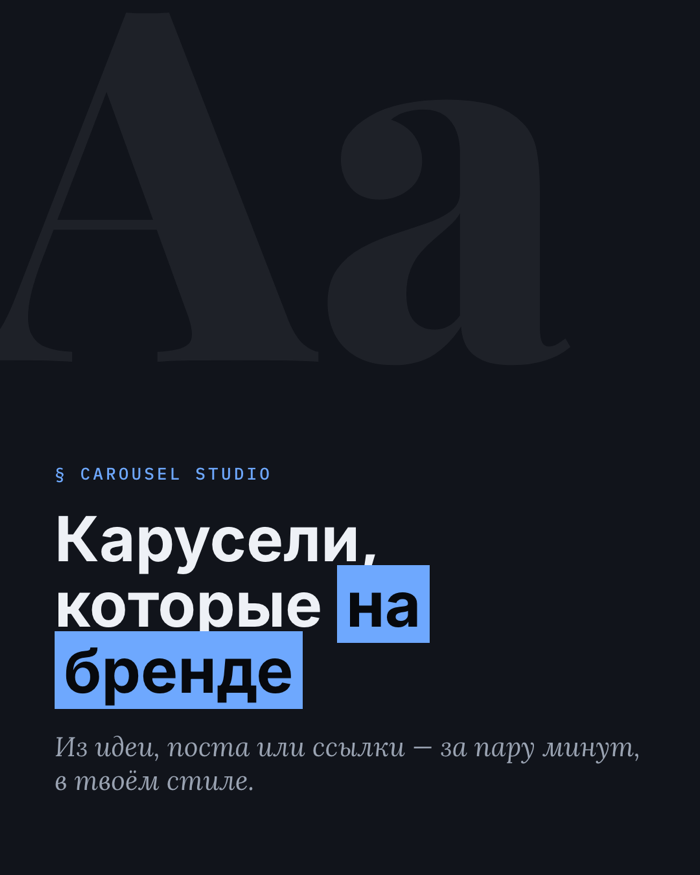
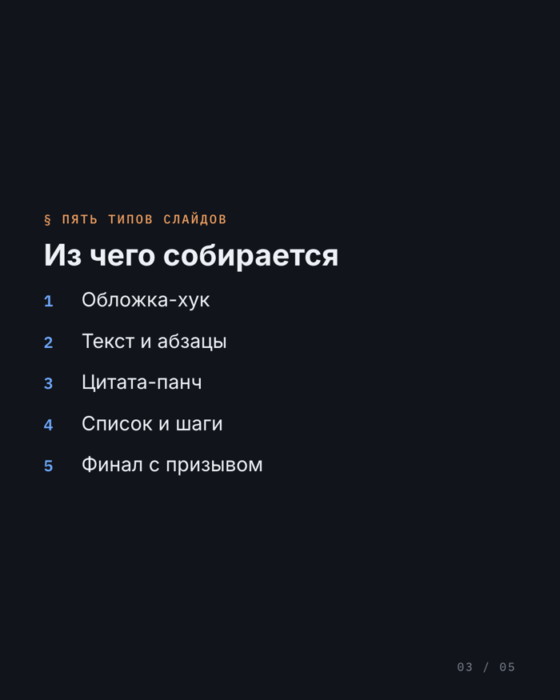
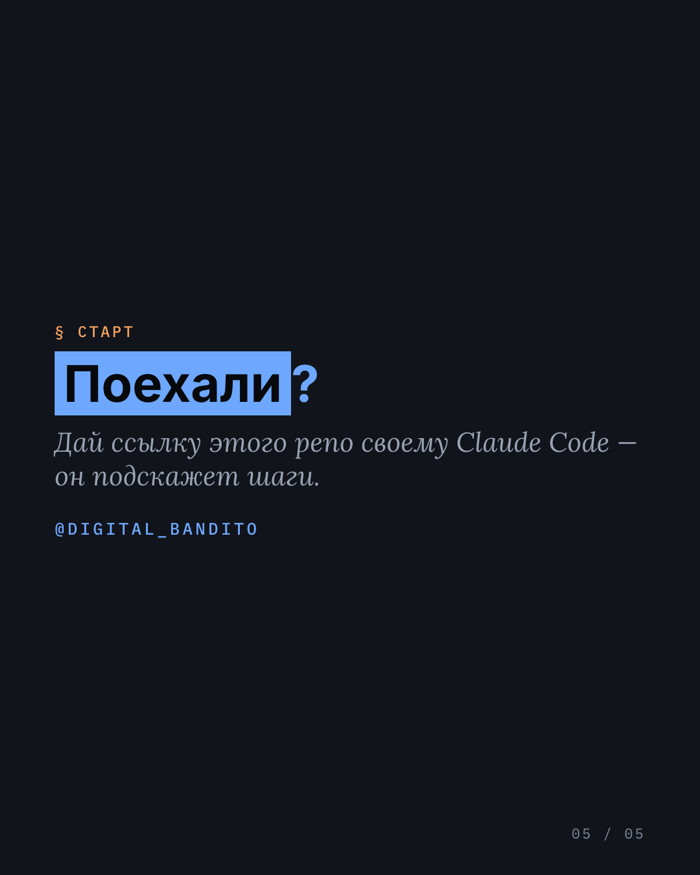

# Carousel Studio

**Плагин для Claude Code: из любой идеи, поста или ссылки — готовая Instagram-карусель на твоём бренде.** Даёшь референсы своего стиля → система разбирает их на дизайн-токены → рендерит текст-идеальные слайды 1080×1350.

<p align="center">
  
  
  
</p>
<p align="center"><sub>Превью на встроенном примере-стиле <code>clean-editorial</code>. С твоим референсом — будет в твоих цветах и шрифтах.</sub></p>

- **На бренде.** Весь вид — из твоих референсов (цвета, шрифты, сетка, лого). Не «как придумает нейросеть».
- **Текст идеальный.** Слайды рисуются вёрсткой (HTML/CSS → headless Chromium), а не генеративной картинкой. Никаких кривых букв.
- **Любой вход.** Готовый пост, сырая идея, тезисы, ссылка — агент сам разберётся.
- **Твой голос.** Копи и подпись — по твоему voice-профилю.
- **Без авто-постинга.** На выходе — папка ассетов (PNG + подпись + alt). Публикуешь сам.

## Поставить — просто дай эту ссылку своему Claude Code

Открой Claude Code в любой папке и напиши ему:

> Поставь плагин по этому репозиторию: https://github.com/PavelKatz/carousel-studio

Claude прочитает этот README и проведёт по шагам. Хочешь руками — три команды:

```
/plugin marketplace add PavelKatz/carousel-studio
/plugin install carousel-studio@digital-bandito
/carousel-setup
```

Нужен **Node.js ≥ 22** (проверь `node -v`). Первый рендер разово скачает Chromium (~100 МБ). Если команды `/carousel…` не появились после установки — перезапусти Claude Code.

> 🤖 **Если ты — ИИ-ассистент, и тебе дали ссылку на этот репозиторий:** это плагин Claude Code. Установку плагина делает ПОЛЬЗОВАТЕЛЬ через слэш-команды — ты их выполнить не можешь, поэтому проведи его за руку: **(1)** проверь `node -v` (нужен ≥ 22; нет — пусть поставит LTS с nodejs.org); **(2)** попроси выполнить `/plugin marketplace add PavelKatz/carousel-studio`, затем `/plugin install carousel-studio@digital-bandito`; **(3)** если `/carousel…` не появились — пусть перезапустит Claude Code; **(4)** затем `/carousel-setup` (визард настройки под его бренд), потом `/carousel <тема|текст|ссылка>`. Методология агента — `reference/carousel-methodology.md`, гайд по референсам — `docs/references-guide.md`.

## Быстрый старт
1. **`/carousel-setup`** — стартовый визард. Проведёт за 5 шагов: бренд → референсы → голос → (опц.) генеративка → пробный рендер. Перед этим стоит глянуть [docs/references-guide.md](docs/references-guide.md) — какие референсы давать.
2. **`/carousel <тема | текст | ссылка>`** — собрать карусель. Или просто: «сделай карусель про X».
3. Готовое лежит в `carousel/output/<дата>_carousel-<slug>/`:
   - `slides/NN-*.png` — слайды,
   - `caption.md` — подпись + хэштеги,
   - `alt.md`, `slides.json`, `brief.md`.

Агент покажет арку и копи **до рендера** — на согласование. Правки дешёвые.

## Что в коробке
```
carousel-studio/
├── agents/carousel-creator.md          # агент-сборщик карусели (7 фаз с гейтами)
├── skills/
│   ├── carousel-setup/                 # стартовый визард
│   └── extract-brand-tokens/           # разбор картинки-референса в дизайн-токены
├── commands/{carousel, carousel-setup} # слэш-команды
├── reference/carousel-methodology.md   # методология (source of truth агента)
├── scripts/carousel-render/            # движок: дизайн-токены → HTML/CSS → PNG (Playwright)
├── docs/references-guide.md            # какие референсы нужны
└── examples/                           # пример-референс, схема токенов, пример слайдов
```

## Как это работает
```
вход (идея/текст/ссылка)
   → агент строит арку → подбирает референс из твоей библиотеки
   → пишет копи слайдов (твой голос) → slides.json
   → движок: токены → CSS-переменные → шаблон → PNG 1080×1350
   → caption + alt
```
Твоя библиотека стилей живёт в проекте (`carousel/brand/<owner>/`), не в плагине — её создаёт визард. Подробно про токены и движок — [scripts/carousel-render/README.md](scripts/carousel-render/README.md).

## Генеративные фоны (опционально)
По умолчанию фоны — чистые из токенов (solid/gradient), бесплатно и детерминированно. Если хочешь AI-фоны/иллюстрации — визард подключит провайдера (Replicate: Flux Kontext / Recraft, либо fal.ai / Gemini) и попросит API-ключ. Без ключа всё работает на токенах.

## Частые вопросы
- **Нет своего референса?** Визард даст скопировать пример `examples/brand/acme/references/clean-editorial` и поправить под себя.
- **Мой шрифт без кириллицы / нестандартный?** В движке зашиты Inter, Lora, Playfair Display, IBM Plex Mono (кириллица+латиница). Другой — догрузи через `scripts/carousel-render/scripts/fetch-fonts.mjs`.
- **Движок не подготовился сам?** Разово, в терминале: `cd <plugin>/scripts/carousel-render && npm run setup` (зависимости + Chromium + шрифты).
- **Постит ли он сам?** Нет. Отдаёт ассеты + подпись, публикуешь вручную.

## Лицензия / происхождение
Сделано для студентов курсов Digital Bandito. Движок рендера — на Playwright + nunjucks (см. его README). Шрифты — SIL OFL.
